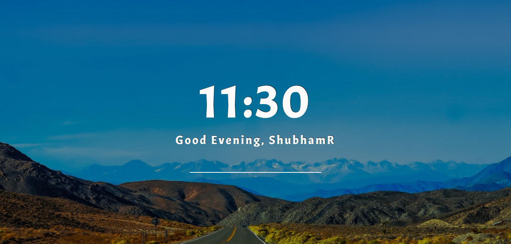
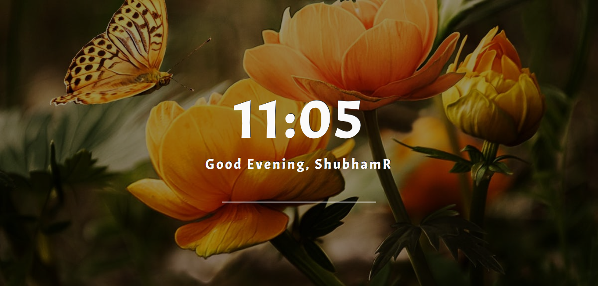
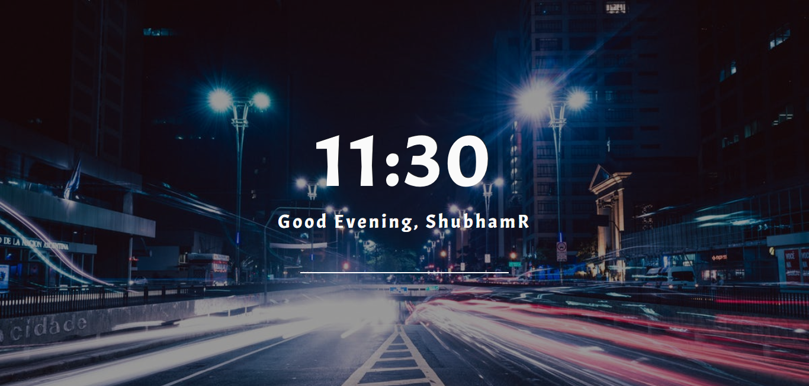
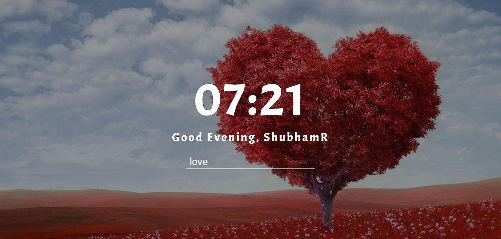
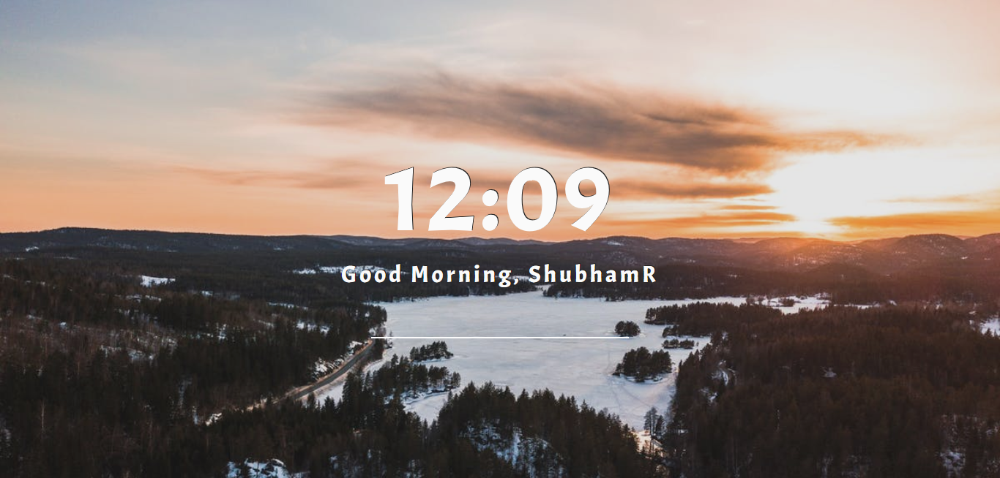

# Homepexel

## Description

A beautiful homepage for browsers to start you session with some beautiful images provided by Pexel. Its is like *momentum* extension available in most of the browsers.
It uses simple Javascript, HTML, and CSS. For background images Pexel API is being used. There are other good API 
available like Pixabay etc.

## How to use?

1. Pull or Download the repository.
2. Request API access key from Pexel https://www.pexels.com/api/ 
3. Once you get the API key open "homepage.js" and set 
 
         |  apikey = yourkey; |
 
  *Other modification provided in comments*

4. Set page as your default homepage.
5. Type whatever category images you want in search bar.
6. DONE!

## SCREENSHOTS

 

## ABOUT PEXEL

It's hard to understand complex licenses that is why all photos on Pexels are licensed under the Creative Commons Zero (CC0) license. This means the pictures are completely free to be used for any legal purpose.

    The pictures are free for personal and even for commercial use.
    You can modify, copy and distribute the photos.
    All without asking for permission or setting a link to the source. So, attribution is not required.

The only restriction is that identifiable people may not appear in a bad light or in a way that they may find offensive, unless they give their consent. You should also make sure the depicted content (people, logos, private property, etc.) is suitable for your application and doesn't infringe any rights.

 
